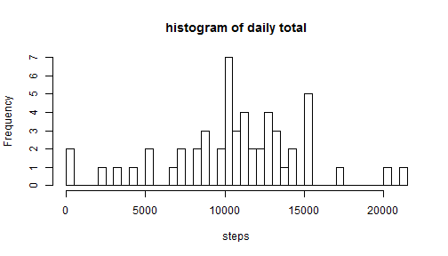
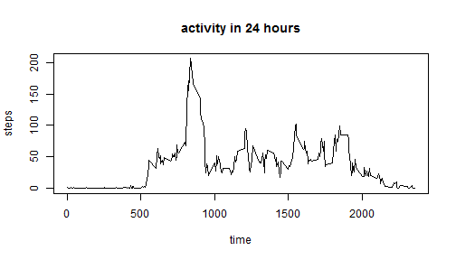
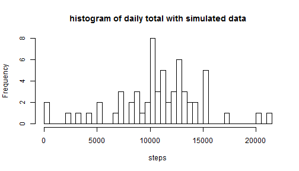
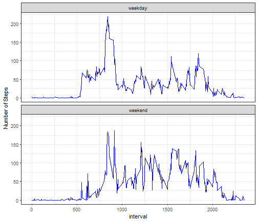

## Introudction
Write a report that answers the questions in format of R markdown file. The questions are listed in **Assignment** section. 

This assignment makes use of data from a personal activity monitoring device. This device collects data at 5 minute intervals through out the day. the data is availible for download [here](https://d396qusza40orc.cloudfront.net/repdata%2Fdata%2Factivity.zip)


## Assignment
The requirement of each topic is copied from [instructor repo](https://github.com/yszhangit/RepData_PeerAssessment1)

### Loading and preprocessing the data
Show any code that is needed to

- Load the data (i.e. read.csv())

- Process/transform the data (if necessary) into a format suitable for your analysis


**Answer:**  
load library  
import csv file with predefined column type and NA string


```r
dat<-read.csv("activity.csv",colClasses=c("numeric","Date","numeric"), na.strings="NA")
```

### What is mean total number of steps taken per day
For this part of the assignment, you can ignore the missing values in the dataset.

- Make a histogram of the total number of steps taken each day

- Calculate and report the mean and median total number of steps taken per day

**Answer:**  
1. group data by date, caculate total, mean, and median  
add a column of string value of date, this is for xtable  

```r
daily_total <- dat[!is.na(dat$steps),] %>% 
  group_by(date) %>% 
  summarize(total=sum(steps))
daily_total_mean=as.character(round(mean(daily_total$total),2))   # not to use Scientific notation in knit
daily_total_median=as.character(round(median(daily_total$total),2))
```

2. Histogram of total steps pre day


```r
hist((daily_total$total), breaks=50, main="histogram of daily total",xlab="steps")
```



3. Mean value of total steps each day is 10766.19, median is 10765


### What is the average daily activity pattern?
- Make a time series plot (i.e. type = "l") of the 5-minute interval (x-axis) and the average number of steps taken, averaged across all days (y-axis)

- Which 5-minute interval, on average across all the days in the dataset, contains the maximum number of steps?

**Answer:**  
1. average over groups of 5 minutes interval, display with line plot.

```r
by_interval <- dat[!is.na(dat$steps) ,] %>% group_by(interval) %>% summarize(mean=mean(steps))
plot(by_interval$interval, by_interval$mean, type="l", main="activity in 24 hours", ylab="steps", xlab="time")
```




```r
five_minutes_max<-max(by_interval$mean)
```

2. max number of 5-minute interval is 206.1698113

### Imputing missing values
- Calculate and report the total number of missing values in the dataset (i.e. the total number of rows with NAs)

- Devise a strategy for filling in all of the missing values in the dataset. The strategy does not need to be sophisticated. For example, you could use the mean/median for that day, or the mean for that 5-minute interval, etc.

- Create a new dataset that is equal to the original dataset but with the missing data filled in.

- Make a histogram of the total number of steps taken each day and Calculate and report the mean and median total number of steps taken per day. Do these values differ from the estimates from the first part of the assignment? What is the impact of imputing missing data on the estimates of the total daily number of steps?

**Answer:**

- noticed the dataset NA steps are all happen at same day, either entire day is missed or not at all. this make the simulation unnecessary, just copy mean or median values to missing day intervals.

- to do it in hard way, assumming the missing steps are random, we will pick any value from the list, the list is made up from all non-na values in same interval.


```r
dat1 <- dat
# not R way, and it is slow, can someone teach me better method?
for ( i in 1: nrow(dat1) ) {
  if ( ! is.na(dat[i, "steps"]) ) { next }
  samples <- dat[dat$interval==dat[i, "interval"] & ! is.na(dat$steps), "steps"]
  dat1[i, "steps"] <- sample (samples, 1, replace = T)
}
```

2. re-do the plots, *no noticable differce*


```r
daily_total_1 <- dat1 %>% 
  group_by(date) %>% 
  summarize(total=sum(steps))
daily_total_mean_1=as.character(round(mean(daily_total_1$total),2))
daily_total_median_1=as.character(round(median(daily_total_1$total),2))
```

```r
hist((daily_total_1$total), breaks=50, main="histogram of daily total with simulated data",xlab="steps")
```



3. Mean value of total steps each day is 10814.8, median is 11015, compares to results from dataset without simulated data, the difference is very small, no real impact.


### Are there differences in activity patterns between weekdays and weekends?
- Create a new factor variable in the dataset with two levels -- "weekday" and "weekend" indicating whether a given date is a weekday or weekend day.

- Make a panel plot containing a time series plot (i.e. type = "l") of the 5-minute interval (x-axis) and the average number of steps taken, averaged across all weekday days or weekend days (y-axis). 

**Answers:**  
1. create weekend and weekday for each row


```r
dat1 <- dat1 %>% mutate( wday = ifelse( strftime(date, "%w") %in% c(0,6), "weekend", "weekday" ) )
```

2. plotting, cant get exactly the sample shows


```r
wdat<- dat1 %>% group_by(interval, wday) %>% summarize(avg_steps = mean(steps))
g<-ggplot(aes(interval, avg_steps), data=wdat)
g + geom_line(color="blue") + facet_wrap( ~wday, nrow=2) + ylab("Number of Steps") + theme_bw()
```



3. Acitivities between weekend and weekday are different, weekday office hour had lower activities but higher during commute hours, weekend activities are more even. 


